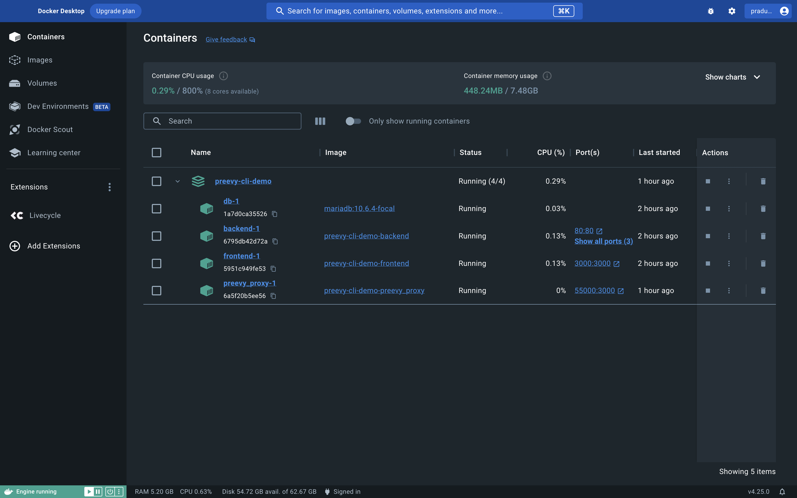

## Livecycle Docker Extension Giveaway

### What is Livecycle Docker Extension?

Livecycle Docker Extension allows you to instantly and securely share your local development environment and receive feedback much earlier in the development workflow, without the hassle of staging environments or CI builds.

### Giveaway Steps (TL;DR)

- [ ] Follow [@get_livecycle](https://twitter.com/get_livecycle) + share this post
- [ ] Install the [Livecycle Docker Extension](https://hub.docker.com/extensions/livecycle/docker-extension) & share a Docker Compose compatible app with (at least) 1 person
- [ ] Share a screenshot of your Livecycle org dashboard on X (AKA Twitter) and tag @get_livecycle and @Docker
- [ ] For BONUS POINTS - say hi in our [Livecycle Slack community](https://community.livecycle.io/)

### Giveaway Steps - With more details

1. **Install the Livecycle Docker Extension:**

   Visit this [link](https://hub.docker.com/extensions/livecycle/docker-extension) and install the Livecycle Docker Extension. Alternatively, search for `Livecycle` in the Docker Extension Marketplace. After installation and opening the extension, you will be prompted to sign in. Sign in using your GitHub or Google account.

2. **Run a Docker Compose application:**

   Run a Docker Compose application on your local machine.

3. **Share your local application:**

   Once your application is running, open the Livecycle Docker Extension. Upon opening the extension, you will see your running application. To share your application, toggle the "Shared" switch. This action will generate a public URL for your application for every service in your application. You can choose to share it publicly or privately.

   Then, click the "Invite" button and invite at least one other person to join your Livecycle "organization". This is a really important step!! 

5. **Share a picture:**

   Take a screenshot of your Livecycle org dashboard showing your app running and post it on X (AKA Twitter) by tagging [@get_livecycle](https://twitter.com/get_livecycle) and [@Docker](https://twitter.com/Docker).

   Even though the names of the people in your org don't show on this screen, we'll be able to verify it on our side.

   For reference, here's an example of the screen we want you to share:
   
   

   <!---->

### FAQ

How do I install the Livecycle Docker Extension?

 
Head over to this [link](https://hub.docker.com/extensions/livecycle/docker-extension) and install the extension, or search for `Livecycle` in the Docker Extension Marketplace.

Who can enter the giveaway?

 
Anyone can enter. 

Who is eligible to win?

 
Anyone who installs the Livecycle Docker Extension, runs an application and shares it with others (via the Livecycle Docker Extension) is eligible to win the giveaway once all of the other conditions are met. 

How long will this giveaway be open for submissions?

 
We are accepting submissions until the end of the day on Monday, November 20, 2023. 

How many people need to enter in order to activate the giveaway?

 
We need at least 500 unique participants to activate the giveaway. So be sure to share this with your Docker-Compose-loving friends and get them to join!!. 

How to join the Livecycle community?

 
Join our community on [Slack](https://community.livecycle.io/).
